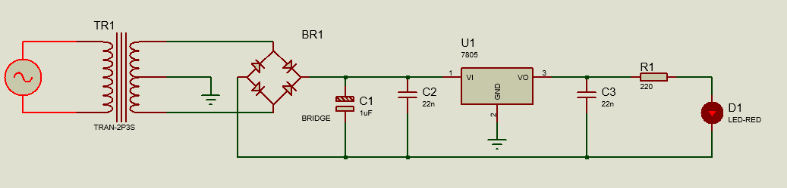

# Retificador de Onda Completa - Esquemático

## Esquemático do circuito de retificador de onda completa

  

## Fluxo do processo
1. A corrente alternada é reduzida pelo transformador.
2. A ponte retificadora converte corrente alteranda em corrente contínua.
3. O capacitor C1 suaviza a tensão.
4. O regulador 7805 estabiliza a saída em 5V.
5. Os capacitores C2 e C3 garantem estabilidade.
6. O LED emite luz e indica que a saída está funcionando.

## Dispositivos utilizados
- **Tranformador**: converte a tensão da rede elétrica para 12V CA.
- **Ponte de Diodo**: converte a corrente alternada (CA) em corrente contínua pulsante (CC).
- **Capacitor**: suaviza a tensão após a retificação.
- **Regulador de Tensão**: reduz a tensão para 5V para alimentar os circuitos.
- **Resistor**: limita a corrente para evitar queimar o LED.
- **LED**: emissor de luz.
