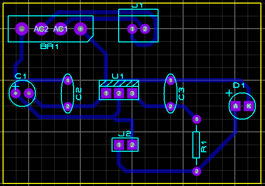

# Retificador de Onda Completa - PCB

## Pcb layout do circuito de retificador de onda completa

  

## Fluxo do processo
1. O concetor SIL-100-02 é conectado a ponte de díodo.
2. A ponte e díodo converte corrente alteranada em corrente contínua.
3. O capacitor C1 suaviza a tensão.
4. O regulador U1 ajusta a tensão para um valor específico.
5. Os capacitores C2 e C3 garantem um funcionamento estável.
6. O circuito fornece uma tensão estabilizada no conector J2.

## Dispositivos utilizados
- **Conector SIL-100-02 (J1)**: conector de alimentação para fornecer tensão ao circuito.
- **Ponte de Diodo (BR1)**: converte a corrente alternada (CA) em corrente contínua pulsante (CC).
- **Capacitor (C1, C2 e C3)**: suaviza a tensão após a retificação.
- **Regulador de Tensão (U1)**: reduz a tensão para 5V para alimentar os circuitos.
- **Resistor (R1)**: limita a corrente para evitar queimar o LED.
- **LED (D1)**: emissor de luz.
- **Conector CONN-SIL2 (J2)**: saída regulada para alimentar o circuito.
